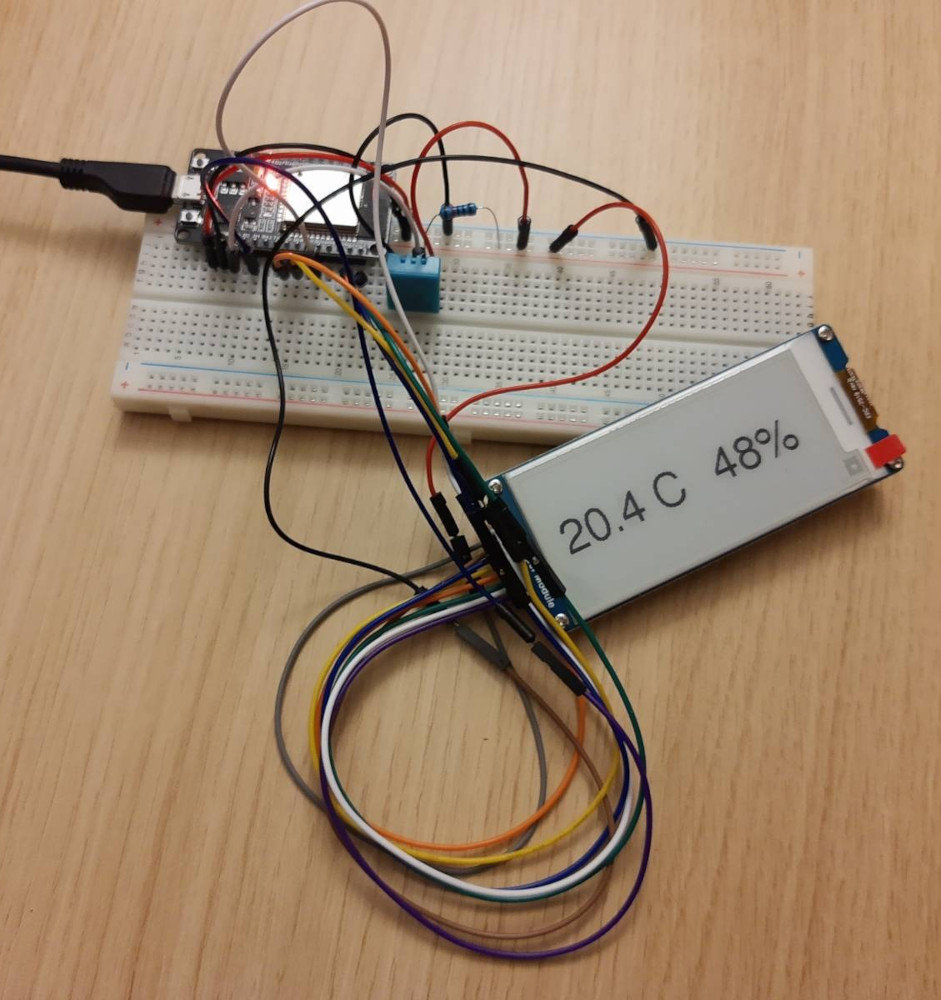

# ESP32 Thermometer

I am trying to develop an inner and outer temperature and humidity measuring device
based on an ESP32 board, using an e-ink display and powered by a battery. This is
my first serious project, I'm pretty sure I'm going to learn a lot ;-).

Desired features:
* low power consumption
* at least one external sensor, ideally communicating over RF
* battery status indicator
* nice yet low-power display (e-ink, bought a WaveShare 2.9in)
* later, this should be connected to a local HomeAssistant installation (or similar)

## Images



## Lessons learned

### DHT11 Reset

If you see something like this `Failed to read from DHT sensor!`, you've probably
stumbled upon one of the many pages sharing the same example code on reading
measurements from the DHT11 sensor. What these don't tell you is how to re-establish
the connection to the sensor so you can fix those `nan` readings. 

This **only** applies to the situation when your board suddenly **stops showing**
the measured values and starts displaying `nan`.

If your code never displayed any measurements and started with `nan`, there are
[other sources to consult](https://randomnerdtutorials.com/solved-dht11-dht22-failed-to-read-from-dht-sensor/).

And now to the solution, I'm not sure it covers all possible situations, but it
has worked as a charm for me so far:

```C
if (isnan(humidity) || isnan(temperature)) {
  dht.begin();
}
```

Yes, that seems to be it, simply try restarting the connection to the sensor using
`dht.begin()`.

Tested by unplugging and re-plugging the sensor, see the video below.

[](https://youtu.be/VTe1ncc6I-Q)

